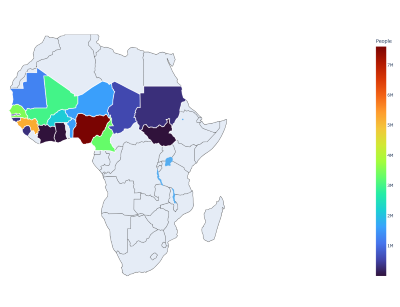

# awesome_fula_nl_resources

<!-- vscode-markdown-toc -->
* 1. [context](#context)
* 2. [tools](#tools)
	* 2.1. [machine learning models](#machinelearningmodels)
	* 2.2. [crowdsourcing platforms](#crowdsourcingplatforms)
	* 2.3. [android apps](#androidapps)
	* 2.4. [github repo](#githubrepo)
* 3. [datasets](#datasets)
	* 3.1. [datasets translation](#datasetstranslation)
		* 3.1.1. [ Bible](#Bible)
		* 3.1.2. [ Coran](#Coran)
		* 3.1.3. [NLLB](#NLLB)
		* 3.1.4. [wikimedia](#wikimedia)
		* 3.1.5. [QED](#QED)
		* 3.1.6. [copyrighted translations](#copyrightedtranslations)
	* 3.2. [dictionaries](#dictionaries)
		* 3.2.1. [online dictionaries](#onlinedictionaries)
		* 3.2.2. [pdf dictionaries](#pdfdictionaries)
	* 3.3. [dataset unlabeled text](#datasetunlabeledtext)
	* 3.4. [datasets audio](#datasetsaudio)
* 4. [ other resources](#otherresources)
	* 4.1. [fulfulde resources](#fulfulderesources)

<!-- vscode-markdown-toc-config
	numbering=true
	autoSave=true
	/vscode-markdown-toc-config -->
<!-- /vscode-markdown-toc -->

##  1. context

Fula/Fulani is a language spoken by 40 million people across 18 countries in West and Central Africa.

It belongs to the Niger-Congo family, specifically the Atlantic-Congo branch, under the Atlantic group known as Senegambian languages. It is composed of numerous dialects, including Pulaar, Fulfulde, and Maasina.

Resources mentioned here favour Pular spoken in Guinea.

## ISO-639 codes
- 639-1 : ff - Fula/Fulah
- ISO 639-2 : ful – Fula/Fulah
- ISO 639-3 codes according to [ethnologue.com](https://www.ethnologue.com/subgroup/3024/) and [sil.org](https://iso639-3.sil.org/code/ful):
	- fuc – Pulaar (Senegambia, Mauritania)
	- fuf – Pular (Guinea, Sierra Leone)
	- ffm – Maasina Fulfulde (Mali, Ivory Coast, and Ghana by 1.6 m)
	- fue – Borgu Fulfulde (Benin, Togo)
	- fuh – Western Niger Fulfulde (Burkina, Niger)
	- fuq – Central–Eastern Niger Fulfulde (Niger)
	- fuv – Nigerian Fulfulde (Nigeria)
	- fub – Adamawa Fulfulde (Cameroon, Chad, Nigeria)
	- fui – Bagirmi Fulfulde (CAR)(Chad)

[alphabet](alphabet.txt)

_map from [maria-kosogorova FulaLanguageMap](https://github.com/maria-kosogorova/FulaLanguageMap)_

##  2. tools
- [google translate](https://translate.google.com/?sl=fr&tl=ff&op=translate)

###  2.1. machine learning models
- translation & speech to text - [firtanam.cawoylel.com](https://firtanam.cawoylel.com/) 
- translations - [sil.org Alpha 2](https://alpha2.multilingualai.com/languages?sourceCollectionId=50092&translationModelId=&ttsModelId=null&targetLanguage=fuh&page=1&pageSize=50)
	- fuq - Central-Eastern Niger - fine-tuned NLLB and Alpine models
	- ffm - Maasina -  fine-tuned NLLB and Alpine models
	- fuv - Nigerian - NLLB only

- translation only - [huggingface.co/spaces/flutter-painter/nllb-fra-fuf-v2](https://huggingface.co/spaces/flutter-painter/nllb-fra-fuf-v2)

###  2.2. crowdsourcing platforms
- Language technology tools for Fula - [cawoylel.com](https://cawoylel.com/) 
- [Common Voice ff / Pootoon](https://pontoon.mozilla.org/ff/common-voice/)

###  2.3. android apps
- books: [Defte Pulaar](https://play.google.com/store/apps/details?id=org.ips.bah.fuc.defte)
- Pulaar - English translations: [Fula: Pulaar To English](https://play.google.com/store/apps/details?id=techrisemedia.com.fula&hl=en&gl=US)
- [Fula android keyboard](https://play.google.com/store/apps/details?id=com.type.fulfulde.fula.english.keyboard.fulfuldekeyboard.infra&hl=de_CH)

###  2.4. github repo
- spelling checker - [github.com/BirdiD/Spelling-corrector-Pulaar](https://github.com/BirdiD/Spelling-corrector-Pulaar)
- predict the suffix form of a given fula noun - [github.com/yaya-sy/fula_noun_suffix_alternantions](https://github.com/yaya-sy/fula_noun_suffix_alternantions)

##  3. datasets
###  3.1. datasets translation
####  3.1.1.  Bible
Text already extracted and available in [dataset/fra-ful/bible_fr_ff.txt](dataset/fra-ful/bible_fr_ff.txt)

- new testament fula (guinea) (sql) - [ebible.org fuf](https://ebible.org/details.php?id=fuf)
- new testament french (sql) - [ebible.org fra](https://ebible.org/details.php?id=frasbl)

####  3.1.2.  Coran
Text already extracted and available in [dataset/fra-ful/quran_fr_ff.txt](dataset/fra-ful/quran_fr_ff.txt)

sources : 
- [tanzil translations](https://tanzil.net/trans/)
- [islamhouse.com](https://islamhouse.com/ff/main/)
- [archive.org](https://archive.org/details/Quran_Ful)
- [ia803107.us.archive.org](https://ia803107.us.archive.org/30/items/Quran_Ful/Quran_ful_text.pdf)

####  3.1.3. NLLB 
- [opus.nlpl.eu/NLLB/en&ff/v1/NLLB](https://opus.nlpl.eu/NLLB/en&ff/v1/NLLB)
####  3.1.4. wikimedia 
- [wikimedia fr](https://object.pouta.csc.fi/OPUS-QED/v2.0a/mono/fr.txt.gz)
- [wikimedia ff](https://object.pouta.csc.fi/OPUS-wikimedia/v20230407/mono/ff.txt.gz)
####  3.1.5. QED
- [QED fr](https://object.pouta.csc.fi/OPUS-QED/v2.0a/mono/fr.txt.gz) 
- [QED ff](https://object.pouta.csc.fi/OPUS-QED/v2.0a/mono/ff.txt.gz)

####  3.1.6. copyrighted translations
- [ellaf textes-peuls](http://ellaf.huma-num.fr/corpora/textes-peuls/)

###  3.2. dictionaries
####  3.2.1. online dictionaries
- french to fula [webonary.org/pular](https://www.webonary.org/pular/) by Oumar Bah
- english to fulani [pink-frannie-25](https://pink-frannie-25.tiiny.site/)

####  3.2.2. pdf dictionaries
- [Dictionnaire peul de l'agriculture et de la nature](https://collaboratif.cirad.fr/alfresco/s/d/workspace/SpacesStore/1bdf94f6-8c47-44e0-9772-a8f0e886fb41/16976.pdf)

- [Dictionnaire peul du corps et de la santé](https://horizon.documentation.ird.fr/exl-doc/pleins_textes/2022-03/010045999.pdf)

- [Vocabulaire du monde rural](https://www.google.com/url?q=https://shs.hal.science/halshs-03265219/document&sa=U&ved=2ahUKEwis7-Kj7aWDAxVGfKQEHWG7D8w4KBAWegQIBxAC&usg=AOvVaw3mSoxTzRnoxuZ3LZS1nZNz)

###  3.3. dataset unlabeled text 
- [pulaar.org](https://pulaar.org/)
- [wikipedia fula](https://ff.wikipedia.org/wiki/Hello_ja%C9%93%C9%93orgo)

###  3.4. datasets audio
- Pangloss CNRS
	- [Les Peuls donnent aux Bangande le nom de Dicko](https://pangloss.cnrs.fr/corpus/show?oai_primary=cocoon-a55e0b18-39fd-4609-9e0b-1839fd760918&oai_secondary=cocoon-9f8493e7-13b5-4805-8493-e713b5b805c8&filter=%7B%22form-s%22%3A%7B%22phono%22%3A1%7D%2C%22transl-s%22%3A%7B%22en%22%3A1%7D%2C%22transl-t%22%3A%7B%22en%22%3A0%7D%2C%22form-t%22%3A%7B%22phono%22%3A0%7D%7D)

- [deftepulaar.com](https://www.deftepulaar.com/)

- French African Accented [openslr.org/57](https://www.openslr.org/57/) 
  - Cameroon Niger 
  - Apache 2.0
- West African Virtual Assistant Speech Recognition Corpus [openslr.org/106/](https://www.openslr.org/106/) 
  - French, Maninka, Pular and Susu 
  - CC BY-SA 4.0
- West African Radio Corpus - unsupervised training - [openslr.org/105](https://www.openslr.org/105/)
  - French, Guerze, Koniaka, Kissi, Kono, Maninka, Mano, Pular, Susu, and Toma
  - CC BY-SA 4.0

- Bible audio
  - [globalrecordings.net fr fuf](https://globalrecordings.net/fr/language/fuf)
  - [globalrecordings.net fr ful](https://globalrecordings.net/fr/language/ful) 
  - [faithcomesbyhearing.com](https://www.faithcomesbyhearing.com/)
  - [find.bible](https://find.bible/en/bibles/)

- google/fleurs 
	- [hugging face](https://huggingface.co/datasets/google/fleurs)
	- [Pulaar Sénégal fleurs.ff_sn](https://huggingface.co/datasets/google/xtreme_s/viewer/fleurs.ff_sn)
	- [storage.googleapis.com FLEURS/ff_sn](https://storage.googleapis.com/xtreme_translations/FLEURS/ff_sn.tar.gz)

##  4.  other resources
- about the language : https://senelangues.huma-num.fr/pdf/peul.pdf
- about the people : https://www.webpulaaku.site/defte/index.html
- youtube teacher : https://www.youtube.com/watch?v=vZkuHlujBfY

###  4.1. fulfulde resources
- Nigerian Fulfulde dataset [huggingface.co/datasets/gsarti/flores_101](https://huggingface.co/datasets/gsarti/flores_101/viewer/ful)

- cantique eglise adventiste in fulfude
  - https://github.com/Touza-Isaac/Deftere-Gimmi-Be-Fulfulde
  - version fr : https://www.hymnes.net/
  - https://adventlife.fr/hymnes-et-louanges/a-celui-qui-nous-a-sauves-079/
